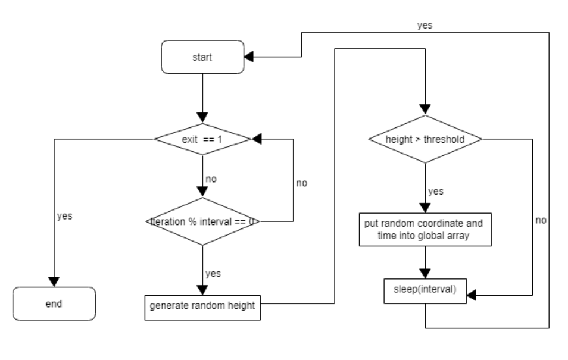

# Tsunami Detection in a Distributed Wireless Sensor Network (WSN) Simulation

This project simulates a tsunami detection system using a distributed wireless sensor network (WSN). The system is designed to detect changes in sea levels by simulating sensor nodes (Tsunameters) in a 2D grid topology, which communicate with a central Base station. The simulation is implemented using C and utilizes MPI (Message Passing Interface) and POSIX threads for parallel processing and inter-node communication.

## Methodology

### 1. Altimeter
The Altimeter is a POSIX thread created by the Base process. It continuously generates random coordinates and height values at specified intervals, simulating altimeter readings. These values are stored in a global circular buffer, ensuring efficient data management. Mutex locks are used to prevent race conditions during data writing and reading. The thread runs continuously until it receives a termination signal from the Base.



*Figure 1. Technical flow chart for Altimeter. The exit value determines the end of the loop and the interval determines when to generate the random values. Height generated is then checked with threshold and thread is put to sleep to simulate waiting. The loop is repeated.*

### 2. Base
The Base process acts as the central controller, managing both the Altimeter and the Tsunameter nodes. It receives data from the Tsunameters, compares it with the Altimeter readings, and logs the results. The Base communicates with the Tsunameters using MPI and controls the overall execution of the simulation. It also handles user input for terminating the simulation and sends termination signals to all nodes.

### 3. Tsunameter
The Tsunameter nodes are simulated using a 2D grid topology created with MPI. Each node generates random sea level readings, calculates a moving average, and compares it with the readings from its neighboring nodes. If the readings indicate a potential tsunami, the node reports the event to the Base. The Tsunameters operate in parallel, continuously processing data and communicating with the Base until they receive a termination signal.

## Files in the Repository

- **README.md**: This file.
- **altimeter.c**: Implementation of the Altimeter thread.
- **altimeter.h**: Header file for the Altimeter thread.
- **base.c**: Implementation of the Base process.
- **base.h**: Header file for the Base process.
- **compile_instruction.txt**: Instructions for compiling the program.
- **main.c**: Main entry point for the simulation.
- **sample_log.txt**: Sample log file generated by the simulation.
- **shared.h**: Header file containing shared definitions and data structures.
- **tsunameter.c**: Implementation of the Tsunameter nodes.
- **tsunameter.h**: Header file for the Tsunameter nodes.
- **utilities.c**: Utility functions used throughout the program.
- **utilities.h**: Header file for utility functions.

## Compilation Instructions

To compile the program, use the following command:

```bash
mpicc main.c base.c altimeter.c tsunameter.c utilities.c -o main.o -lm
```

## Running the Simulation

To run the simulation, use the following command:

```bash
mpirun -oversubscribe -np N main.o y x
```

- `N`: Number of processes (number of Tsunameter nodes + 1 for the Base).
- `y` & `x`: Grid size for the 2D topology.

